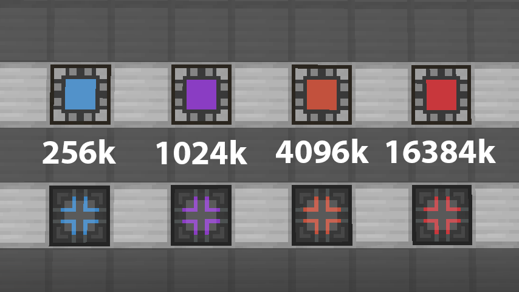

# **Extra CPUs**

> A [Minecraft] mod to give you more Crafting Storages for [Applied Energistics 2][ae2].

[][curseforge]
[][curseforge]

- [Discord]
- [CurseForge project page][curseforge]

---

 

<!-- Table of Contents -->

    

        <strong>Table of Contents (click to expand)</strong>
    

- [**Extra CPUs**](#extra-cpus)
  - [**📑 Overview**](#-overview)
  - [**🐛 Limitations**](#-limitations)
  - [**🔧 Installation**](#-installation)
  - [**📕 History**](#-history)
  - [**⏰ Changelog**](#-changelog)
  - [**🎓 License**](#-license)
  - [**✨ Comment**](#-comment)

## **📑 Overview**
This is a mod for [Minecraft] [Forge]. It will add additional Crafting Storages which can be used with [Applied Energistics 2][ae2].

They can be used to save space because the built-in Crafting Storages have a maximum capacity of 64k.

The crafting recipes use the cells from [Extra Cells].

[Applied Energistics 2][ae2] and [Extra Cells] are dependencies for this mod.

    

        <strong>Preview (click to expand)</strong>
    

## **🐛 Limitations**
Due to how [Applied Energistics 2][ae2] is made and built, there are some limitations you have to keep in mind:

- the Crafting Storage blocks of this mod will only work if at least one Crafting Storage block of the original mod [Applied Energistics 2][ae2] is in the same multiblock, otherwise they are just not being recognized by the ME system
- they will not glow in the dark
- they won't connect their textures properly
  - they still recognize a valid multiblock structure
  - i made different textures for valid and invalid structures
  - they will have a brighter color when power is connected

## **🔧 Installation**

1. Download the latest **mod jar** from the [releases] or from [curseforge].
2. Install Minecraft [Forge].
3. Install the dependency mods [Applied Energistics 2][ae2] and [Extra Cells].
4. Drop the **jar file** into your mods folder.

## **📕 History**
This is a port of the [Extra Crafting Storage mod][original mod] by [Zoko061602][author].

He discontinued his mod and since it's running under the [GPL 3 license](./LICENSE), I decided to update it.

I am using a different approach for the new version and also remade the textures so it's more like an overhauled version.

## **⏰ Changelog**
Everything related to versions and their release notes can be found in the [changelog].

## **🎓 License**
This project is licensed under the [GPL 3].

## **✨ Comment**
This is one of my first mods. If you find a better way of implementing these blocks so their behaviour works properly, feel free to submit a [pull request].

<!-- Links -->
[Minecraft]: https://www.minecraft.net/
[ae2]: https://www.curseforge.com/minecraft/mc-mods/applied-energistics-2
[Discord]: https://discordapp.com/invite/Q3qxws6
[curseforge]: https://www.curseforge.com/
[Extra Cells]: https://www.curseforge.com/minecraft/mc-mods/extracells2
[releases]: https://github.com/RLNT/sinus-staff-list/releases
[Forge]: http://files.minecraftforge.net/
[original mod]: https://github.com/Zoko061602/ExtraCraftingStorage
[author]: https://github.com/Zoko061602
[changelog]: CHANGELOG.md
[GPL 3]: LICENSE.md
[pull request]: https://github.com/RLNT/minecraft-extracpus/pulls
